# OSM to SHP Fastex Converter

Flexible OSM2SHP Fastex Converter (convert .osm &amp; .pbf files to ESRI Shape .shp files and .dbf) with Web Progress     
Программа-конвертер файлов данных OSM (*.osm) и (*.pbf) в ESRI Shapes (*.shp) c web-визуализацией

### Get OpenStreetMap DATA - Данные OpenStreetMap

[OpenStreetMap](https://www.openstreetmap.org/export) - OSM        
[OSM Planet in PBF format](https://planet.openstreetmap.org/pbf/)     
[OSM Planet in OSM format](https://planet.openstreetmap.org/planet/)    
[GeoFabric PBF+OSM format](https://download.geofabrik.de/)    
[BBBike](https://extract.bbbike.org/), use:  Protocolbuffer (PBF) file format       
[BBBike Extracted](https://download.bbbike.org/osm/extract/), use:  Protocolbuffer (PBF) file format   

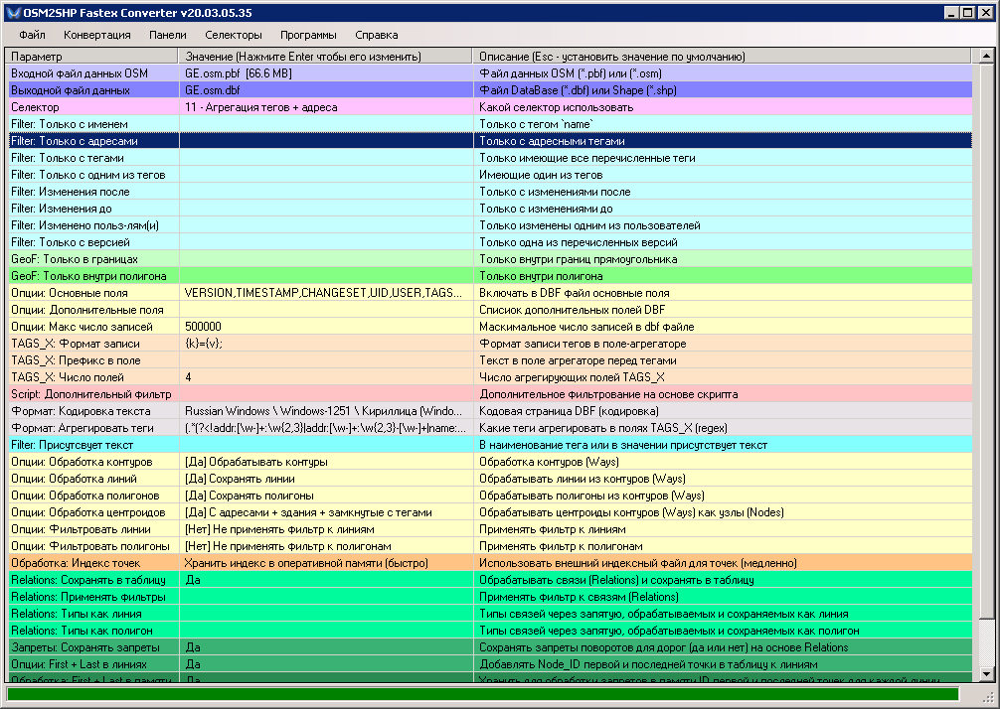
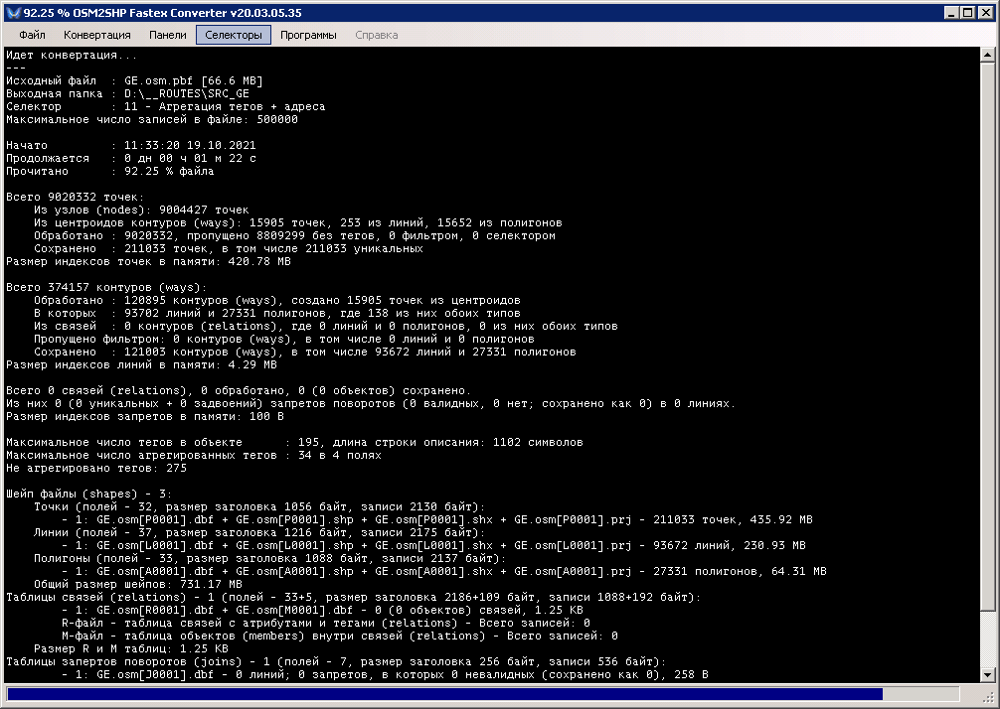
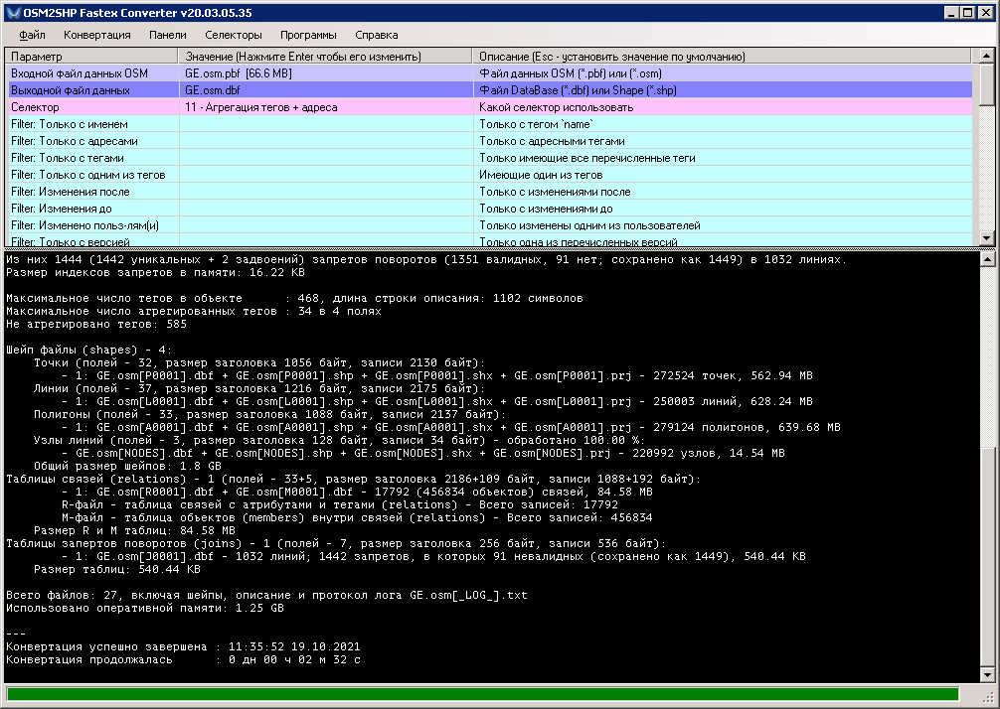
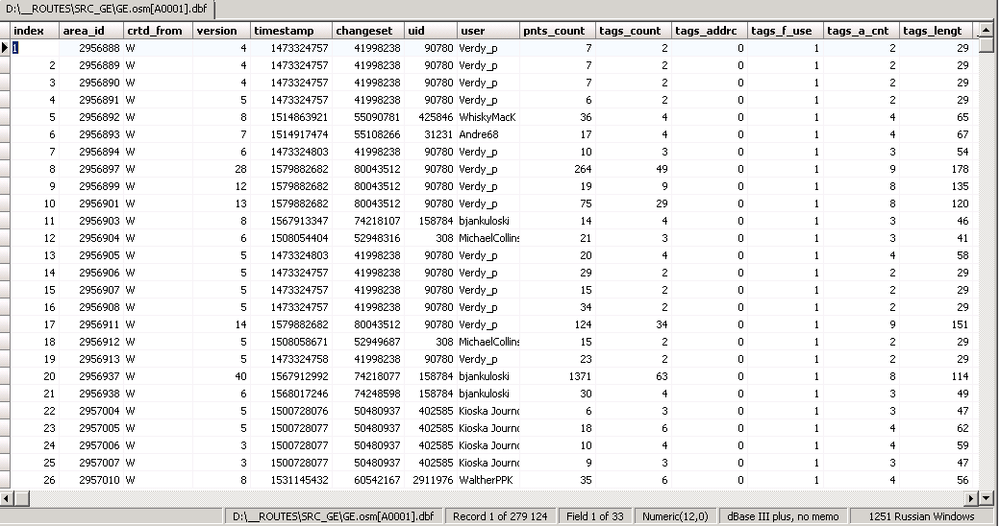
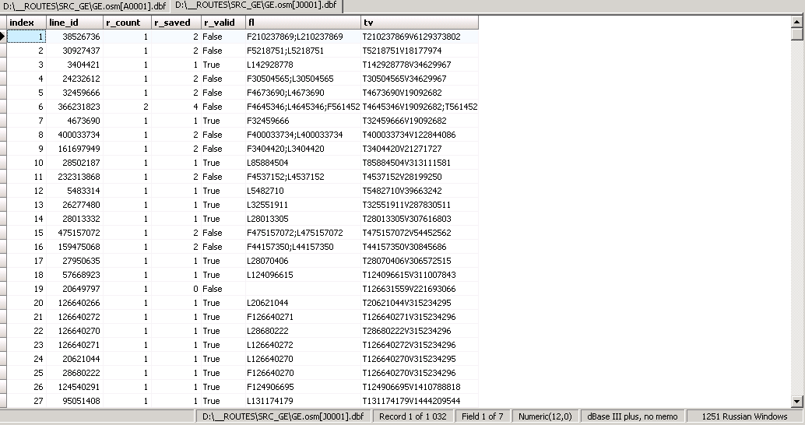
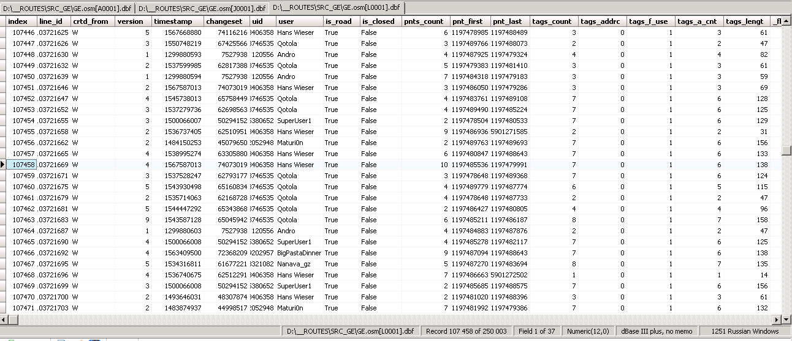
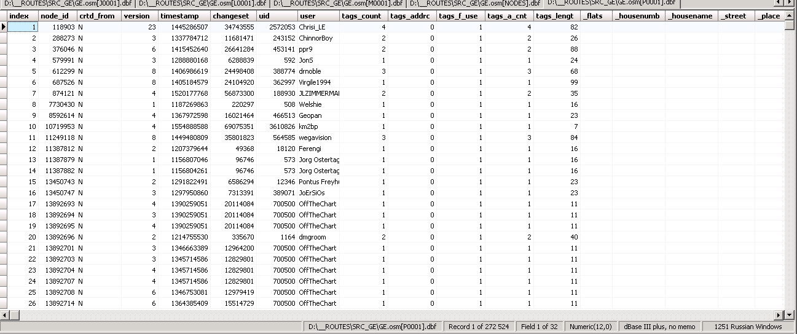
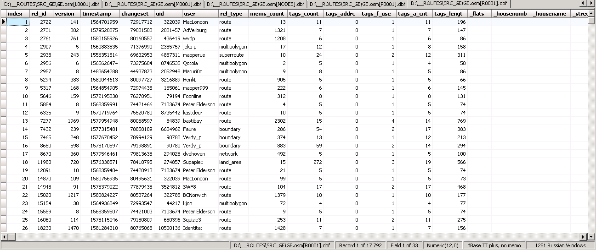
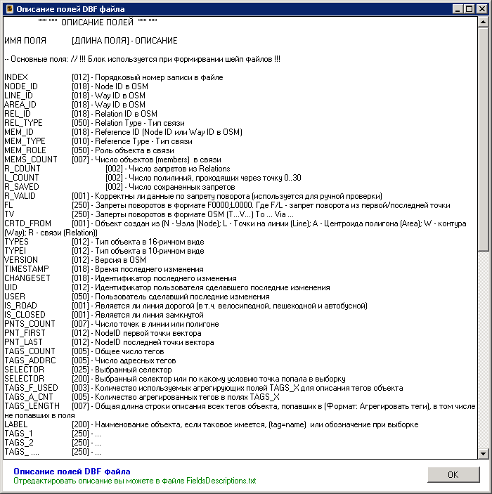
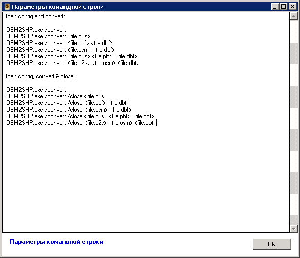
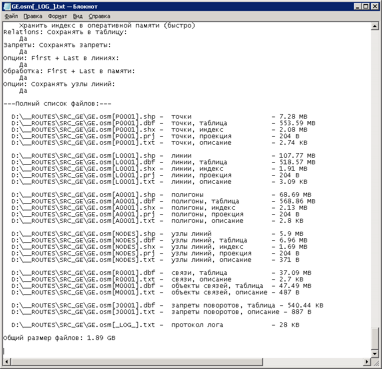
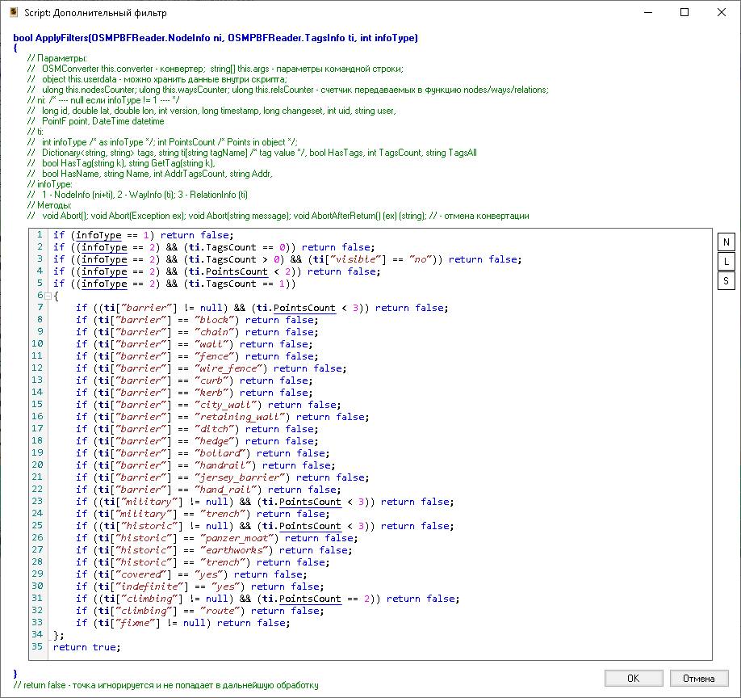

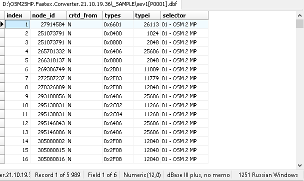
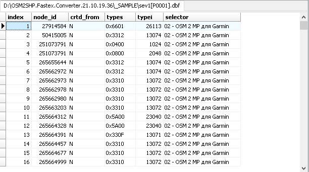
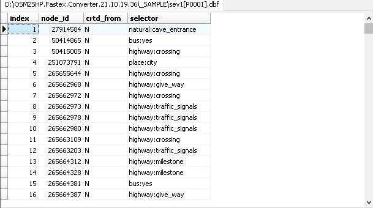
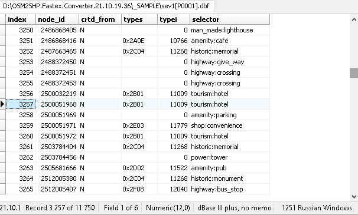
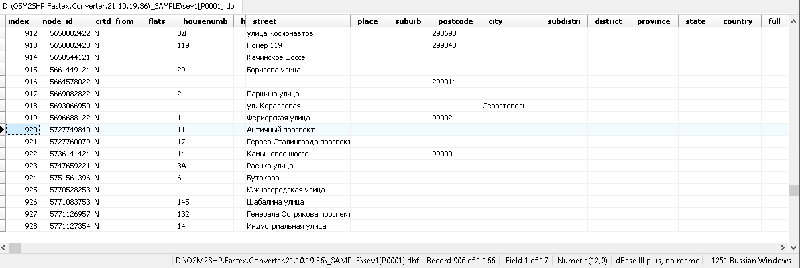
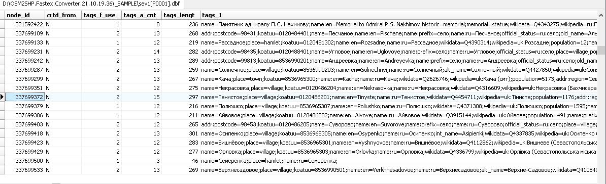
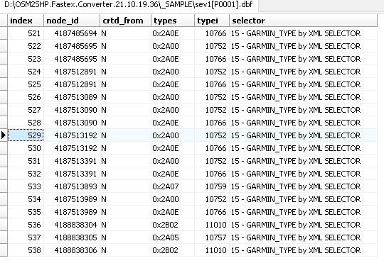
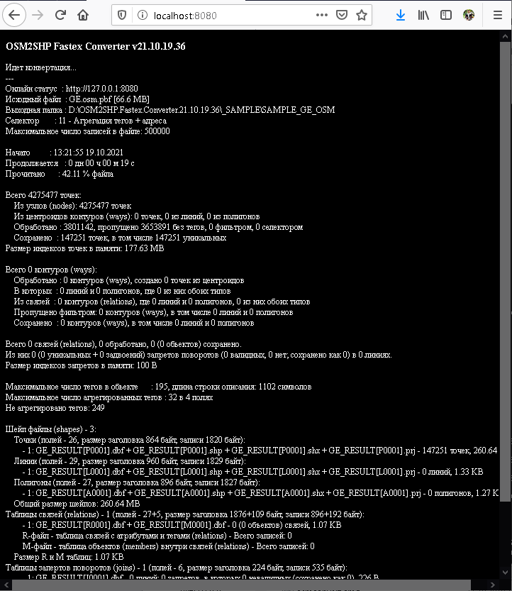
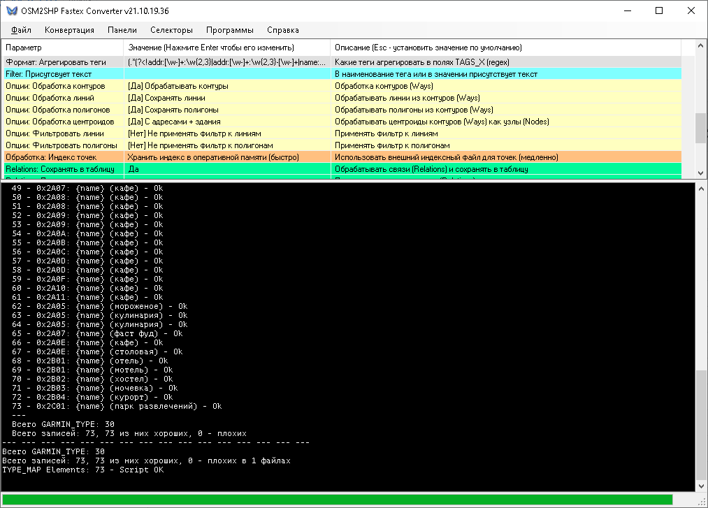
